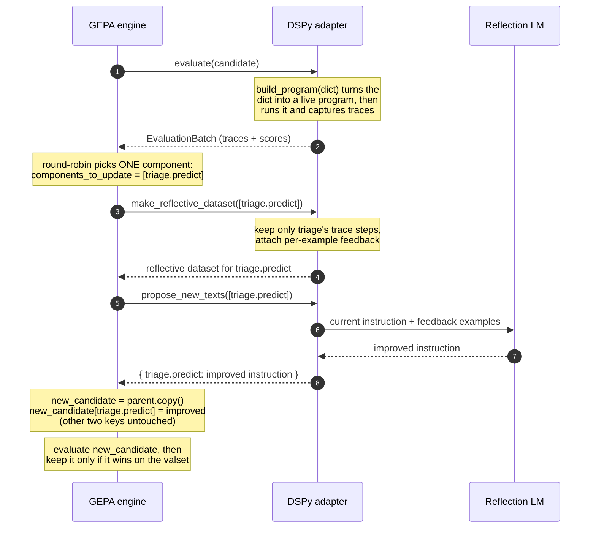

# A multi-agent program is several prompts in a trench coat.

_AI-generated entry. See [What & Why](/posts/what-and-why) for context._

---

In my [last deep dive on GEPA](/posts/non-obvious-things-about-gepa), I traced the search algorithm: per-example Pareto frontiers, specialists evolving into generalists, mini-batch sampling, and how the metric's feedback teaches the reflection LLM what to fix.

But I skipped a question that only shows up when you optimize a program with more than one predictor.

GEPA talks about optimizing "components." DSPy talks about "predictors." When I run GEPA on a three-agent program, how does GEPA know _which_ of my agents it is looking at in a given round? And when it produces a better prompt, how does that prompt get back to the _right_ agent?

For a single-predictor program you never think about this. For a multi-agent program, it is the whole game. So I traced it through the source.

The punchline first: **there is no mapping table.** DSPy and GEPA share one dictionary, and the predictor's name _is_ the component's name. Everything else follows from that.

## The example: a three-agent support resolver

Let me make this concrete. Here is a small DSPy program that turns a support ticket into a drafted reply. Three agents, each a `dspy.ChainOfThought`.

> A side note on the word "agent." These three are not agents in the strict sense: no tool use, no loop, no autonomy. They are just predictors in a fixed pipeline, and I am calling them agents to keep the example readable. But the GEPA story does not depend on that simplification. Swap any of them for a real `dspy.ReAct` agent and the picture only widens: a `ReAct` module is itself built from predictors — one that drives the reasoning-and-tool-call loop, and one that extracts the final answer — so it contributes _two_ keys to the candidate dict, not one. GEPA still does the same thing to each: every predictor is its own named component, selected and rewritten one at a time. A multi-agent system is just a program with more predictors, and GEPA sees all of them as keys in the same dict.

```python
import dspy

class TriageTicket(dspy.Signature):
    """Classify a support ticket."""              # ← agent 1's instruction
    ticket   = dspy.InputField()
    category = dspy.OutputField(desc="one of: billing, bug, how-to, account")
    priority = dspy.OutputField(desc="P0, P1, or P2")

class WriteKBQuery(dspy.Signature):
    """Write a search query for the help-center knowledge base."""  # ← agent 2
    ticket   = dspy.InputField()
    category = dspy.InputField()
    query    = dspy.OutputField()

class DraftReply(dspy.Signature):
    """Draft a customer-facing reply."""          # ← agent 3's instruction
    ticket   = dspy.InputField()
    category = dspy.InputField()
    articles = dspy.InputField(desc="retrieved KB articles")
    reply    = dspy.OutputField()

class SupportResolver(dspy.Module):
    def __init__(self, kb):
        super().__init__()
        self.kb          = kb
        self.triage      = dspy.ChainOfThought(TriageTicket)
        self.write_query = dspy.ChainOfThought(WriteKBQuery)
        self.compose     = dspy.ChainOfThought(DraftReply)

    def forward(self, ticket):
        t        = self.triage(ticket=ticket)
        q        = self.write_query(ticket=ticket, category=t.category)
        articles = self.kb.search(q.query, k=3)
        r        = self.compose(ticket=ticket, category=t.category, articles=articles)
        return dspy.Prediction(category=t.category, priority=t.priority, reply=r.reply)
```

The thing to notice: each agent's _instruction_ is just its signature's docstring. That string is the only thing GEPA will ever change.

## What GEPA actually starts from

When you call `compile()`, the first thing GEPA does is ask the module for its predictors and snapshot their instructions into a plain dict. This is the **seed candidate**.

```python
# dspy/teleprompt/gepa/gepa.py
seed_candidate = {name: pred.signature.instructions
                  for name, pred in student.named_predictors()}

# {
#   "triage.predict":      "Classify a support ticket.",
#   "write_query.predict": "Write a search query for the help-center knowledge base.",
#   "compose.predict":     "Draft a customer-facing reply.",
# }
```

That dictionary is the entire interface between DSPy and GEPA. Its keys are the predictor names straight from `named_predictors()`. GEPA calls each key a **component** and treats it as an opaque label. It never inspects the string, never parses the name, never builds a lookup table.

On its side, GEPA just records the keys once:

```python
# gepa/src/gepa/core/state.py
self.list_of_named_predictors = list(seed_candidate.keys())
# ["triage.predict", "write_query.predict", "compose.predict"]
```

That list is GEPA's complete idea of "the things I am allowed to edit." Everything downstream refers to agents by these strings.

## The metric does double duty

GEPA cannot improve a prompt from a bare number. It needs to know _why_ an output was bad, in words. So a GEPA metric returns a `dspy.Prediction` carrying both a `score` and a `feedback` string. (I wrote more about why the feedback matters as much as the score in the [previous GEPA post](/posts/non-obvious-things-about-gepa), and about curating the data that feeds it in [Is Data Curation the New Feature Engineering?](/posts/is-data-curation-new-feature-engineering).)

The part relevant to multi-agent programs: DSPy hands your metric a `pred_name` argument, so you can aim the feedback at whichever agent is currently under review.

```python
def resolution_metric(gold, pred, trace=None, pred_name=None, pred_trace=None):
    score, notes = 0.0, []

    if pred.category == gold.category:
        score += 0.4
    else:
        notes.append(f"Category should be '{gold.category}', got '{pred.category}'.")

    if pred.priority == gold.priority:
        score += 0.2
    else:
        notes.append(f"Priority should be '{gold.priority}', got '{pred.priority}'.")

    score += 0.4 * reply_quality(pred.reply, gold.reply)  # rubric or LLM-judge

    # Sharpen the feedback for the agent GEPA is reflecting on right now:
    if pred_name == "triage.predict" and pred.category != gold.category:
        notes.append("Billing signals: 'charged', 'refund', 'invoice', 'double-billed'.")
    elif pred_name == "compose.predict" and not cites_article(pred.reply):
        notes.append("Reply did not reference any retrieved article; ground every claim.")

    return dspy.Prediction(score=score, feedback=" ".join(notes) or "Looks correct.")
```

Kicking off the run is three lines. `reflection_lm` is the strong model GEPA uses to _rewrite_ prompts; it is separate from the model your program runs on.

```python
from dspy import GEPA

optimizer = GEPA(
    metric        = resolution_metric,
    reflection_lm = dspy.LM("openai/gpt-5", temperature=1.0),
    auto          = "medium",   # sets the metric-call budget
)
optimized = optimizer.compile(SupportResolver(kb), trainset=train, valset=val)
```

## One round, as a sequence

Now the actual loop. Every iteration crosses the boundary between the GEPA engine and DSPy's adapter a few times. Here it is as a sequence, for a round that happens to land on the triage agent.



Let me walk the two steps that answer the original question.

### Choosing which agent to improve

This is the "which predictor am I looking at?" moment. The default component selector is plain round-robin. It keeps a per-candidate cursor and returns _one_ component name per iteration.

```python
# gepa/src/gepa/strategies/component_selector.py
class RoundRobinReflectionComponentSelector:
    def __call__(self, state, trajectories, scores, candidate_idx, candidate):
        pid  = state.named_predictor_id_to_update_next_for_program_candidate[candidate_idx]
        state.named_predictor_id_to_update_next_for_program_candidate[candidate_idx] = \
              (pid + 1) % len(state.list_of_named_predictors)
        name = state.list_of_named_predictors[pid]
        return [name]      # e.g. ["triage.predict"] — just one
```

Because `list_of_named_predictors` is exactly the seed candidate's keys, iteration 1 optimizes `triage`, iteration 2 `write_query`, iteration 3 `compose`, iteration 4 wraps back to `triage`. GEPA never tries to fix everything at once.

The chosen name then rides along as `components_to_update` into every adapter call for the rest of the round. That is how DSPy is _told_ which agent to build a reflective dataset for and which instruction to rewrite.

### Rewriting the instruction

GEPA delegates the actual text generation back to DSPy, which reads the old instruction with `candidate[name]` and runs GEPA's reflection prompt over the feedback dataset.

```python
# dspy/teleprompt/gepa/gepa_utils.py
def propose_new_texts(self, candidate, reflective_dataset, components_to_update):
    results = {}
    for name in components_to_update:              # just ["triage.predict"]
        base_instruction      = candidate[name]
        dataset_with_feedback = reflective_dataset[name]
        results[name] = InstructionProposalSignature.run(
            lm=..., input_dict={
                "current_instruction_doc": base_instruction,
                "dataset_with_feedback":   dataset_with_feedback,
            })["new_instruction"]
    return results        # { "triage.predict": "<a much better instruction>" }
```

The default reflection prompt is worth seeing in full. The placeholders `<curr_param>` and `<side_info>` get filled with the old instruction and the formatted examples-with-feedback:

````text
I provided an assistant with the following instructions to perform a task for me:
```
<curr_param>
```

The following are examples of different task inputs provided to the assistant along
with the assistant's response for each of them, and some feedback on how the
assistant's response could be better:
```
<side_info>
```

Your task is to write a new instruction for the assistant.

Read the inputs carefully and identify the input format and infer detailed task
description about the task I wish to solve with the assistant.

Read all the assistant responses and the corresponding feedback. Identify all niche
and domain specific factual information about the task and include it in the
instruction, as a lot of it may not be available to the assistant in the future.
The assistant may have utilized a generalizable strategy to solve the task, if so,
include that in the instruction as well.

Provide the new instructions within ``` blocks.
````

Fed a few tickets where the triager guessed "how-to" on what were obviously billing complaints, this turns the one-line seed instruction into something domain-aware:

**Before (seed):**

```text
Classify a support ticket.
```

**After (GEPA-proposed):**

```text
Classify the ticket into exactly one category: billing, bug, how-to, or account.

- billing — charges, refunds, invoices, duplicate or failed payments
  ("charged", "refund", "invoice").
- bug — something is broken or errors out.
- how-to — usage or configuration questions.
- account — login, access, or plan changes.

Set priority by business impact, not tone: P0 for outage or data loss,
P1 for money at risk or a blocked workflow (e.g. a duplicate charge),
P2 otherwise.
```

## Handing the better prompt back

Once the reflection LM returns new text, GEPA copies the parent candidate and overwrites _only_ the one key it just optimized. The other two agents' instructions are carried over untouched.

```python
# gepa/src/gepa/proposer/reflective_mutation/reflective_mutation.py
new_candidate = ctx.curr_prog.copy()
for pname, text in new_texts.items():
    new_candidate[pname] = text        # same key, new value
```

This is the entire "reply." GEPA never needs a model of your architecture. It swaps a string at a key it was handed and moves on.

The reverse trip — turning a winning dict back into a runnable program — is the exact mirror of the seed step. Deep-copy the student, and for each predictor, if its name is a key in the candidate, install the optimized instruction:

```python
# dspy/teleprompt/gepa/gepa_utils.py
def build_program(self, candidate):
    new_prog = self.student.deepcopy()
    for name, pred in new_prog.named_predictors():
        if name in candidate:               # match by name
            pred.signature = pred.signature.with_instructions(candidate[name])
    return new_prog
```

That single `if name in candidate` is the answer to "how does DSPy know which agent an optimized prompt belongs to." No indices, no object handoffs, no translation layer. A dictionary keyed by predictor name, passed back and forth.

## One subtlety I did not expect

Selection and write-back are keyed strictly by name. But there is one place a name is _not_ used: when DSPy attributes captured trace steps to a predictor while building the reflective dataset, it matches on **signature equality**, not the name.

```python
# dspy/teleprompt/gepa/gepa_utils.py
trace_instances = [t for t in trace if t[0].signature.equals(module.signature)]
```

In practice this is identical to matching by name. But if two agents happen to share an _identical_ signature — same docstring, same fields — their traces cannot be told apart at this one step. Selection and substitution stay exact regardless, because those go through the name. It is a corner I would not have guessed from the API, and worth knowing if you ever build a program with two structurally identical predictors.

## Why one-at-a-time is the point

It would be tempting to think GEPA should optimize all three agents together. It deliberately does not, and the round-robin is why it works on multi-agent programs specifically.

Each agent gets optimized against the _current_ behavior of its neighbors. When the reply drafter improves, the failures that remain change, so the feedback the triager sees on its next turn is different. The agents co-adapt instead of being tuned in isolation. This is also where GEPA's [deterministic merge step](/posts/non-obvious-things-about-gepa) earns its keep — it can recombine a candidate whose triager is great with another whose drafter is great, because each agent lives under its own key.

| Step            | Owner | What happens                                            |
| --------------- | ----- | ------------------------------------------------------- |
| Seed            | DSPy  | `named_predictors()` → `dict[name → instruction]`       |
| Select          | GEPA  | Round-robin returns one name, e.g. `["triage.predict"]` |
| Reflect dataset | DSPy  | Filter traces to that agent, attach feedback            |
| Propose         | DSPy  | Reflection LM rewrites `candidate[name]`                |
| Write back      | GEPA  | Overwrite that one key; keep if it wins                 |
| Rebuild         | DSPy  | `if name in candidate` → install instruction            |

If you are running GEPA on a real multi-agent system, the practical takeaways are small but real. Give each agent a distinct signature so trace attribution stays clean. Write per-`pred_name` feedback in your metric so each agent gets pointed criticism instead of a program-level shrug. And expect the run to take a while, because the cursor has to make several passes before the agents settle into prompts that actually cooperate.

That last part connects to the bigger picture I keep coming back to: this is all a search, and the reason it is usable is that DSPy and GEPA make the search [cheap enough to run](/posts/cutting-output-tokens-diffs-not-formats). What is still missing is keeping the whole thing legible over time, which is the itch behind [Helix](/posts/helix-closing-the-loop-on-dspy-programs). But the plumbing underneath is refreshingly simple: names, text, and feedback in; better text under the same names out.

## References

- [GEPA on GitHub](https://github.com/gepa-ai/gepa)
- [GEPA paper — Reflective Prompt Evolution](https://arxiv.org/abs/2507.19457)
- [DSPy](https://dspy.ai/)
- [DSPy GEPA optimizer docs](https://dspy.ai/api/optimizers/GEPA/overview/)
- Companion posts on this blog: [Non-Obvious Things I Learned About GEPA](/posts/non-obvious-things-about-gepa), [Is Data Curation the New Feature Engineering?](/posts/is-data-curation-new-feature-engineering), [LLM Optimization Is a Search Problem](/posts/cutting-output-tokens-diffs-not-formats), and [Helix: Closing the Loop on DSPy Programs](/posts/helix-closing-the-loop-on-dspy-programs)

_Source code references for verification:_

- Seed candidate and metric wiring: `dspy/teleprompt/gepa/gepa.py`
- Build program, reflective dataset, propose new texts: `dspy/teleprompt/gepa/gepa_utils.py`
- Round-robin component selection: `gepa/src/gepa/strategies/component_selector.py`
- Candidate write-back: `gepa/src/gepa/proposer/reflective_mutation/reflective_mutation.py`
- Default reflection prompt: `gepa/src/gepa/strategies/instruction_proposal.py`
